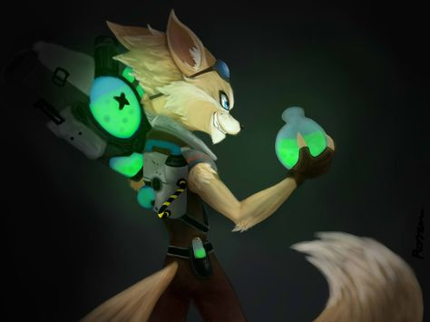

    
    

        
    

     

---
## About Me
- 🎓 I'm a Computer Science student at [EPITA (Ecole pour l'Informatique et les Technniques Avancée)](https://www.epita.fr/en/homepage/)  in Lyon, France
- 🌱 I’m currently in an exchange semester at [Institut Teknologi Sepuluh Nopember (ITS)](https://www.its.ac.id/), in Surabaya, Indonesia 
- 💻 I like to build weird stuff, make random projects and learn new things
- 👯 I’m looking to collaborate on any project that can help me improve my skills
- 📫 How to reach me: [LinkedIn](www.linkedin.com/in/hugo-frangiamone) or by [email](mailto:hugo.frangiamone@proton.me)
- 📝 Would like to know more ? Check out my [resume](https://svartorm.me/)

---
## :hammer_and_wrench: Languages and Tools :

    Languages :
    &nbsp;
    &nbsp;
    
    &nbsp;
    &nbsp;
    &nbsp;
    &nbsp;
    &nbsp;
    &nbsp;
    &nbsp;

    Framework and environment :
    &nbsp;
    &nbsp;
    &nbsp;
    &nbsp;
    &nbsp;
    &nbsp;
    

    Software :
    &nbsp;
    &nbsp;
    &nbsp;
    &nbsp;

---

## :fire: My Stats :

    <!--img src="https://github-readme-stats.vercel.app/api?username=svartorm&show_icons=true&theme=radical" alt="Stats" width="400" height="200"/-->
    
</-div>